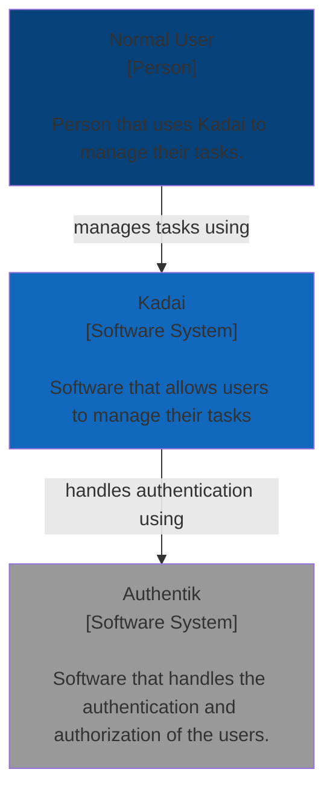
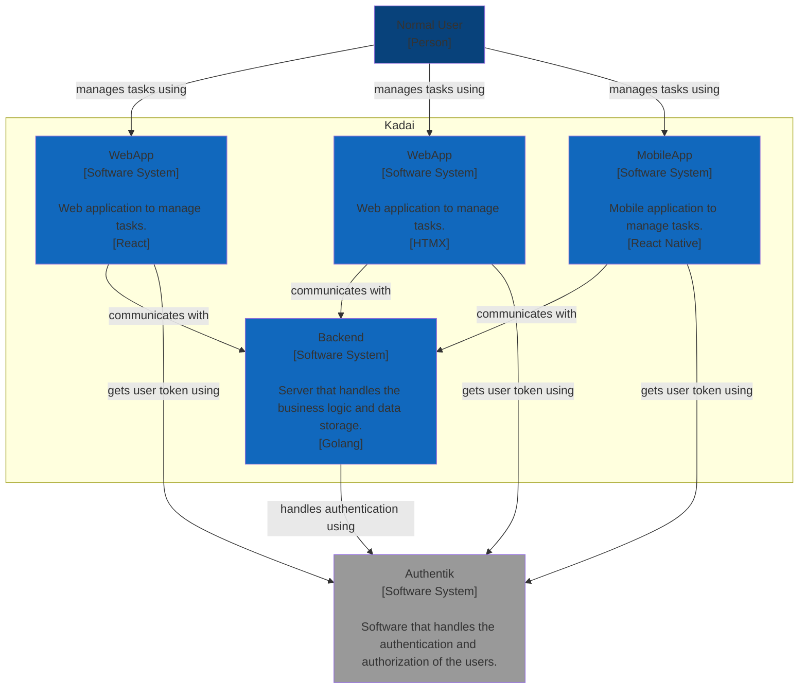

# Software Architecture Document

## 1. Introduction

### 1.1 Purpose

The purpose of this document is to provide a comprehensive overview of the software architecture of the system. It will describe the system's architecture, its components, and the relationships between them.

## 2. Architectural Representation

### 2.1 High-Level Architecture

The system is designed following the client/server architecture. 

The server is a single monolithic application that serves the client requests. The server is responsible for handling the business logic, data storage, and the communication with the clients.

There are two types of clients: the web application and the mobile application. Both clients communicate with the server using HTTP requests.

As for the web applications, and for learning purposes, we will have two different implementations: one using React and another using HTMX. Both implementations will be served by the same server.

### 2.2 Kadai System Architecture

